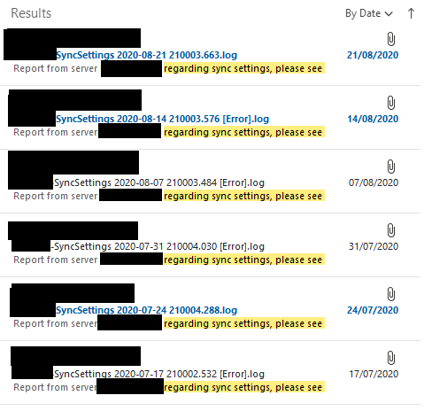

# emailSync
 27/APR/2019 - Use this program with FreeFileSync and it will email you the log results when its finished its latest sync job

Updated 16/JAN/2022

Install
1) Add email settings to the script and compile with AutoHotKey
1) Move this program to the install directory for FreeFileSync (Default C:\Program Files\FreeFileSync)
2) Open FreeFileSync, navigate to the Actions, Synchronization Settings, Synchronization tab.
Then under 'Run a Command' select 'On Completion' and in the example box type 'emailSync.exe'
then click ok to finish.

I have used this program for years without issues.

To test just run emailSync.exe and it will output a logfile with info of results

Example logfile output

	[16/01/22 13:19:24] Starting app..
	[16/01/22 13:19:24] Finding FreeFileSync log files
	[16/01/22 13:19:24] Found log file SyncSettings 2022-01-16 141003.016.html
	[16/01/22 13:19:24] Sending email...
	[16/01/22 13:19:24] Email sent!

